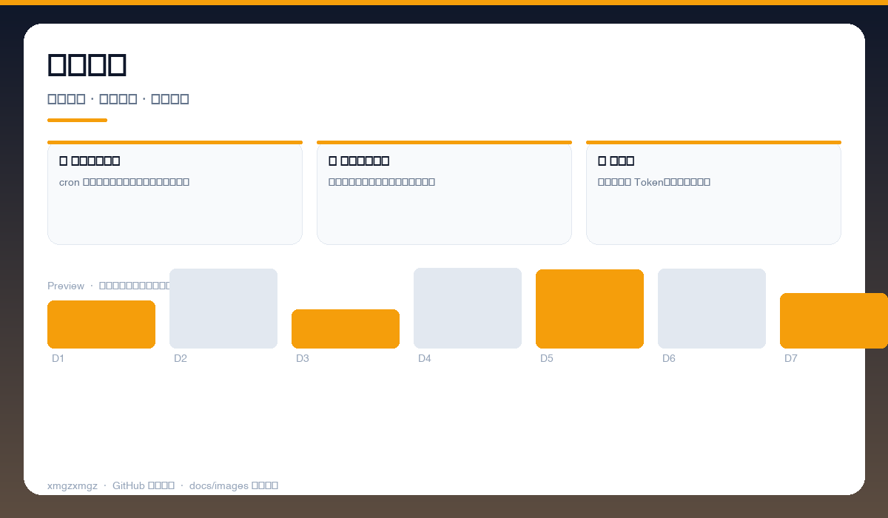
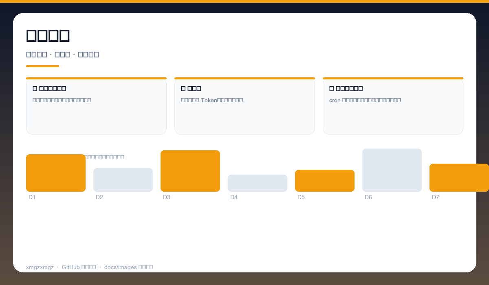
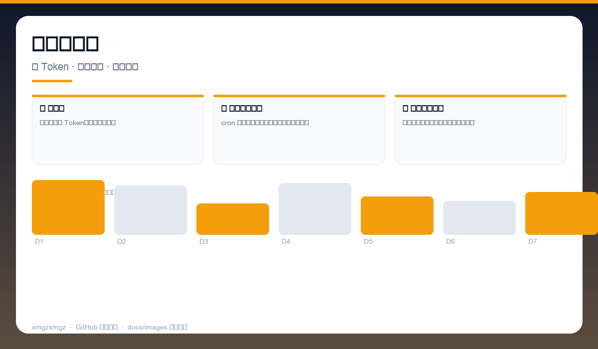

# 🐱 workbuddy-checkin-qinglong — workbuddy-checkin-qinglong

> 青龙面板里的 WorkBuddy 管家 — 每日签到 + 宠物探险自动领积分，多账号无忧。

[](https://github.com/xmgzxmgz/workbuddy-checkin-qinglong)
[](https://github.com/xmgzxmgz/workbuddy-checkin-qinglong/releases)
[](LICENSE)
[](https://github.com/xmgzxmgz/workbuddy-checkin-qinglong/actions/workflows/release.yml)

---

## ✨ 功能一览

| 模块 | 能力 | 状态 |
|------|------|------|
| ✅ 每日自动签到 | cron 定时触发，连续天数与奖励自动记录 | ✅ |
| 🐾 宠物自动探险 | 自动派出与归来领取，旅行日志可查 | ✅ |
| 👥 多账号 | 环境变量多 Token，单脚本管全家 | ✅ |

---

## 📸 功能预览

> 以下为自动生成的示意预览（无需本地部署截图），展示核心功能形态。

| 总览 | 细节 | 流程 |
|------|------|------|
|  |  |  |
| 签到看板 · 今日签到 · 连续天数 · 积分到账 | 宠物探险 · 派出状态 · 目的地 · 自动领取 | 多账号管理 · 多 Token · 执行日志 · 失败告警 |

<details>
<summary>查看大图</summary>


</details>

---

## 🚀 快速开始

```bash
青龙面板 → 订阅管理 → 添加本仓库
环境变量：WB_TOKENS="token1,token2"
定时：0 9 * * * python3 checkin.py
```

---

## 🛠 技术栈

Python · QingLong · Cron · Requests · Multi-Account

---

## 🗂️ 目录结构（节选）

```
workbuddy-checkin-qinglong/
├── docs/images/        # 本 README 的三张自动生成预览图
├── .github/workflows/  # Auto Release 自动发版
├── README.md
└── ...                 # 源码与配置
```

---

## 📦 Releases

本仓库已启用 **Auto Release**（`.github/workflows/release.yml`）：

- 推送 `v*` tag 自动发版：`git tag v0.2.0 && git push origin v0.2.0`
- 手动触发：`gh workflow run "Auto Release" -f version=v0.2.0`（留空则自动 patch +1）
- 变更说明自动生成（`--generate-notes`）

前往 [Releases](https://github.com/xmgzxmgz/workbuddy-checkin-qinglong/releases) 查看。

---

## 🙏 相关项目

- [workbuddy-account-hub](https://github.com/xmgzxmgz/workbuddy-account-hub) — WorkBuddy 账户中枢（本 README 的样板）
- 更多见 [xmgzxmgz 主页](https://github.com/xmgzxmgz)

---

## 许可

MIT
