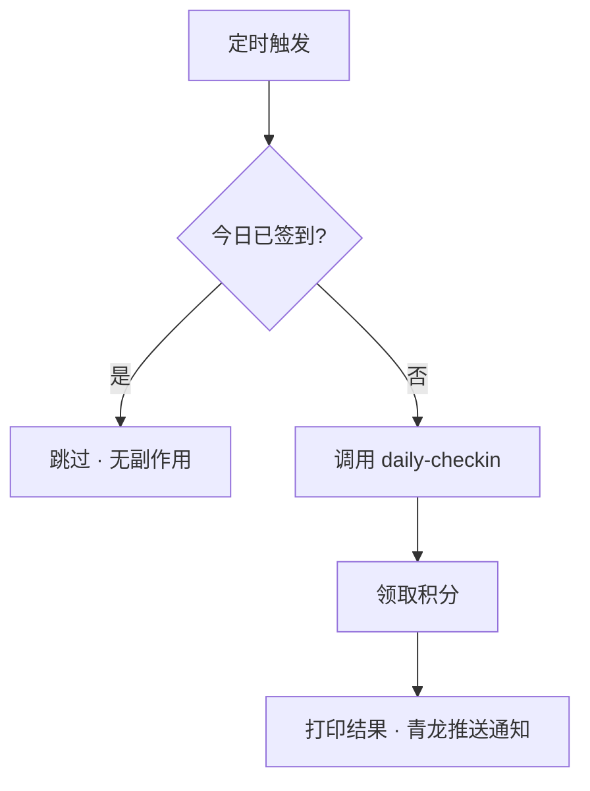
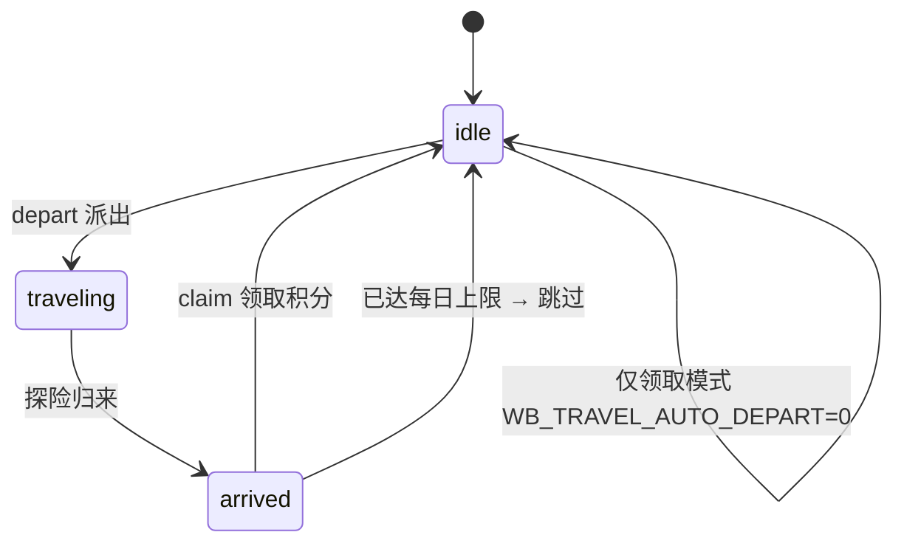
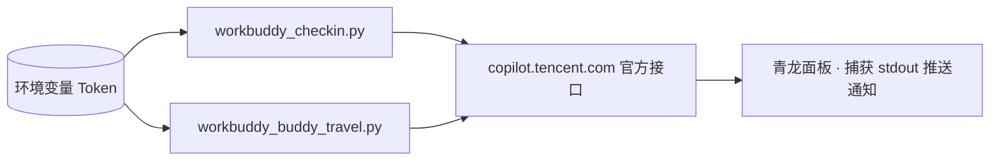

# WorkBuddy 自动化工具箱（青龙面板版） ⚡

> 把 WorkBuddy 的「每日签到」和「宠物自动探险领积分」两个高频手动操作完全自动化，纯 Python 跑在[青龙面板](https://github.com/whyour/qinglong)上定时执行。

[](https://github.com/xmgzxmgz/workbuddy-checkin-qinglong)
[](LICENSE)
[](https://github.com/whyour/qinglong)
[](https://www.python.org)
[](requirements.txt)

[🐱 一键订阅到青龙](#-安装) · [🐛 报 Issue](https://github.com/xmgzxmgz/workbuddy-checkin-qinglong/issues) · [💡 提需求](https://github.com/xmgzxmgz/workbuddy-checkin-qinglong/issues)

---

## 📑 目录
- [✨ 功能](#-功能)
- [💡 为什么用这个](#-为什么用这个)
- [🔧 安装](#-安装)
- [🚀 快速开始](#-快速开始)
- [🔀 工作流](#-工作流)
- [🏗️ 架构](#-架构)
- [🔐 获取 Token](#-获取-token)
- [🌿 环境变量](#-环境变量)
- [🗺️ 路线图](#-路线图)
- [❓ 常见问题](#-常见问题)
- [🙏 致谢](#-致谢)

## ✨ 功能

| 脚本 | 功能 | 状态 |
| --- | --- | --- |
| `workbuddy_checkin.py` | 每日自动签到，领取积分 | ✅ 稳定 |
| `workbuddy_buddy_travel.py` | 宠物自动探险（派出）+ 归来自动领积分 | ✅ 稳定 |

两个脚本共用同一套设计原则：

- **零重依赖**：仅需 `requests`（青龙一般已自带），缺失时自动回退标准库 `urllib`
- **Token 不写死**：全部从环境变量读取，支持多账号一行配置
- **幂等安全**：高频运行无副作用；已签到 / 宠物空闲时调用领取会被优雅跳过
- **青龙友好**：输出直接被面板捕获并推送通知（Server 酱 / 钉钉 / 企业微信 / Telegram）

> ⚠️ 本工具仅向官方接口 `copilot.tencent.com` 发送**你自己的** Bearer Token，不会上传到任何第三方。**Token 属于敏感凭证，请勿提交到公开仓库、也不要在公开场合泄露。** 登录态通常约 90 天有效，过期后需重新获取并更新环境变量。

## 💡 为什么用这个

| 能力 | 本工具 | 手动操作 | 其它签到脚本 |
| --- | --- | --- | --- |
| 每日签到 | ✅ 自动 | ❌ 易忘 | ✅ |
| 宠物探险 + 领积分 | ✅ 全自动 | ❌ 需手动领 | ⚠️ 少见 |
| 多账号一行配置 | ✅ | ❌ | ⚠️ 各异 |
| 幂等可高频跑 | ✅ | — | ⚠️ |
| 零重依赖 | ✅ requests/urllib | — | ❌ 常带重依赖 |

## 🔧 安装

**方式一：青龙面板订阅（推荐）**
1. 打开青龙面板 → **订阅管理** → **新建订阅**
2. 填写：
   - 名称：`workbuddy-checkin`
   - 仓库地址：`https://github.com/xmgzxmgz/workbuddy-checkin-qinglong`
   - 定时规则：`0 0 * * *`（每天 0 点，可按需调整）
3. 保存并**运行一次**拉取脚本

**方式二：本地 / 服务器**
```bash
git clone https://github.com/xmgzxmgz/workbuddy-checkin-qinglong.git
cd workbuddy-checkin-qinglong
pip install -r requirements.txt   # 仅 requests
```

## 🚀 快速开始

配置环境变量（青龙：配置文件 / 环境变量；本地：直接前缀）：

```bash
# 单账号
export WB_ACCESS_TOKEN="eyJxxxx.your.token"

# 多账号（逗号分隔，支持 uid:token 或纯 token）
export WB_ACCESS_TOKENS="eyJ...a,10086:eyJ...b"
```

青龙里给两个脚本分别建任务，命令如：
```bash
task wb_checkin.py
task wb_travel.py
```

本地调试（不依赖青龙）：
```bash
WB_ACCESS_TOKEN=xxxx python3 workbuddy_checkin.py
WB_ACCESS_TOKENS=xxxx python3 workbuddy_buddy_travel.py
```

## 🔀 工作流

**每日签到**


**宠物自动探险（状态机）**


## 🏗️ 架构



## 🔐 获取 Token

1. 登录 WorkBuddy 桌面客户端。
2. 找到本机登录态文件：
   - macOS：`~/Library/Application Support/CodeBuddyExtension/Data/Public/auth/workbuddy-desktop.info`
   - Windows：`%APPDATA%\CodeBuddyExtension\Data\Public\auth/workbuddy-desktop.info`
   - Linux：`~/.config/CodeBuddyExtension/Data/Public/auth/workbuddy-desktop.info`
3. 用任意编辑器打开，取 `auth.accessToken` 字段的整串值（通常以 `eyJ` 开头）作为 Token。

## 🌿 环境变量

| 变量名 | 必填 | 说明 |
| --- | --- | --- |
| `WB_ACCESS_TOKEN` | 二选一 | 单个账号的 Token |
| `WB_ACCESS_TOKENS` | 二选一 | 多账号，逗号分隔；支持 `uid:token` 或纯 `token` |
| `WB_USER_ID` | 否 | 手动指定 X-User-Id；不填时自动从 JWT 解析 `sub` |
| `WB_TRAVEL_LOCATION` | 否 | 宠物探险地点（`workbuddy_buddy_travel.py`）：填数字 id 或 code，不填取配置第一个 |
| `WB_TRAVEL_AUTO_DEPART` | 否 | 默认 `1`；设为 `0` 则【只领取、不自动派出】 |
| `WB_PROXY` | 否 | 默认直连；如需代理填 `http://127.0.0.1:7897` 或 `socks5://127.0.0.1:7897` |
| `QINGLONG_NOTIFY` | 否 | 默认 `1`；设为 `0` 关闭青龙通知标记 |

## 🗺️ 路线图

- [x] 每日自动签到（幂等）
- [x] 宠物自动探险 + 自动领积分（@jinyehyy 提议）
- [ ] 签到日历 / 连续天数统计
- [ ] 失败自愈重试 + 企业微信单独告警
- [ ] Web 配置面板（可视化填 Token）

## ❓ 常见问题

<details>
<summary><b>Q：Token 会过期吗？</b></summary>

会。登录态通常约 90 天有效，过期后脚本调用失败，需重新获取并更新环境变量。
</details>

<details>
<summary><b>Q：多账号怎么配？</b></summary>

用 `WB_ACCESS_TOKENS`，逗号分隔多个 Token；如需指定 uid 用 `uid:token` 形式。
</details>

<details>
<summary><b>Q：高频运行会重复签到 / 重复派宠物吗？</b></summary>

不会。两个脚本都做了幂等处理：已签到直接跳过；宠物 idle 时调用 claim 返回 400 已被处理，不会报错或重复派。
</details>

<details>
<summary><b>Q：没有 requests 能跑吗？</b></summary>

能。脚本优先 `import requests`，缺失时自动回退到标准库 `urllib`，青龙环境通常已自带 requests。
</details>

## 🙏 致谢

本项目的「宠物自动探险并自动领取积分」能力，由社区用户 **[@jinyehyy](https://github.com/jinyehyy)（能猫期货哥）** 在 [Issue #1](https://github.com/xmgzxmgz/workbuddy-checkin-qinglong/issues/1) 中提出并实现跟进，已随 `workbuddy_buddy_travel.py` 一起发布。欢迎更多朋友提 Issue / PR。

## 📄 许可

[MIT](LICENSE) © 贵志

---

<p align="center">用 ⚡ 与 ☕ 制作 · 让签到自动跑</p>
